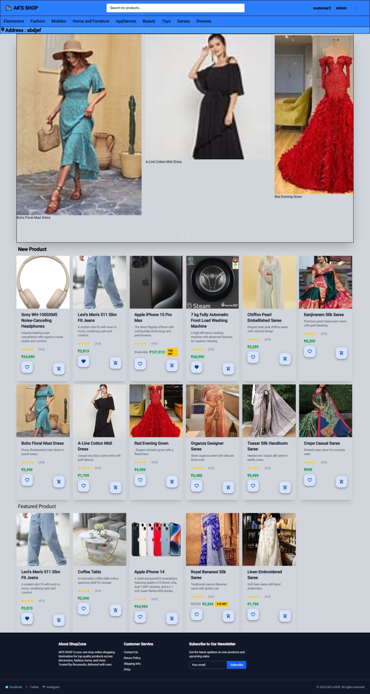

MEAN Stack eCommerce Project

This is a full-stack eCommerce web application built using the MEAN Stack — MongoDB, Express.js, Angular, and Node.js. It includes core features like product management, user authentication, shopping cart, order tracking, and an admin dashboard.

Features

👤 User Side

User registration & login (JWT-based)

Product listing and detail view

Add to cart and update quantity

Checkout and place orders

View order history

🛠️ Admin Side

Admin login and dashboard

CRUD operations on products

View all users and orders

Change order status (e.g., Pending, Shipped, Delivered)

---

🧰 Tech Stack

Layer	Technology

Frontend	Angular 16+
Backend	Node.js, Express
Database	MongoDB (with Mongoose)
Auth	JWT, Bcrypt
UI	Angular Material / Bootstrap
File Upload (optional)	Multer (backend)

<h1>Screenshots</h1>
<table>
<tr>
   <td style="border: 1px solid; padding:10px; text-align:center;">
     
     
<b>Home Page</b>

   </td>
  <td style="border: 1px solid; padding:10px; text-align:center;">
     
     
<b>Login Page</b>

   </td>
  <td style="border: 1px solid; padding:10px; text-align:center;">
     
     
<b>MyOrder Page</b>

   </td>
  <td style="border: 1px solid; padding:10px; text-align:center;">
     
     
<b>OrderDetail Page</b>

   </td>
  <td style="border: 1px solid; padding:10px; text-align:center;">
    
     
<b>SignUp Page</b>

   </td>
   <td style="border: 1px solid; padding:10px; text-align:center;">
    
     
<b>Wishlists Page</b>

   </td>
   <td style="border: 1px solid; padding:10px; text-align:center;">
    
     
<b>YourCart Page</b>

   </td>
</tr>

  
</table>

